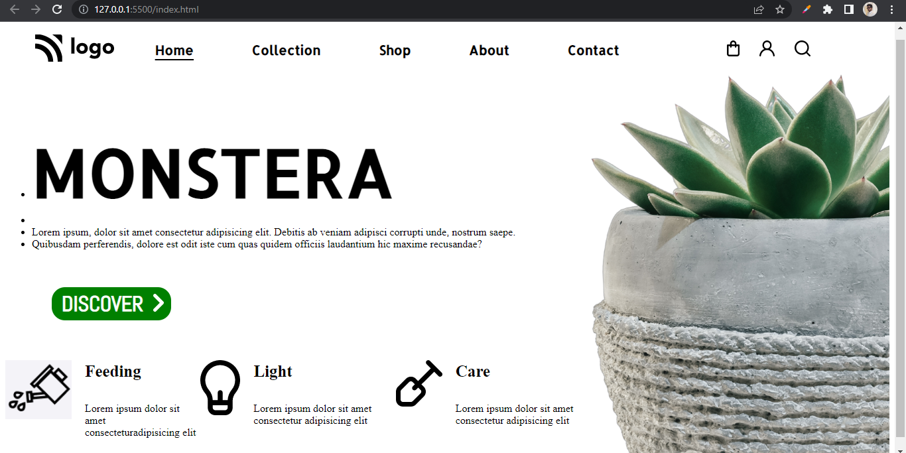

# Assignment 6

## Project 6 [Live Link](https://nachiketkeripaleproject6.netlify.app/)

-  Used ID to target the tag in CSS.
-  In this project, worte CSS in Same html file under style tag.  
-  Used :hover selector on list item. 
-  Used Goolge Fonts for this project.
-  Got idea about how we can user ID to target a element and got clear about the style tag.

---

## Time taken to finish this project

-   3.5 hour to complete it.

#### Screenshot

 

